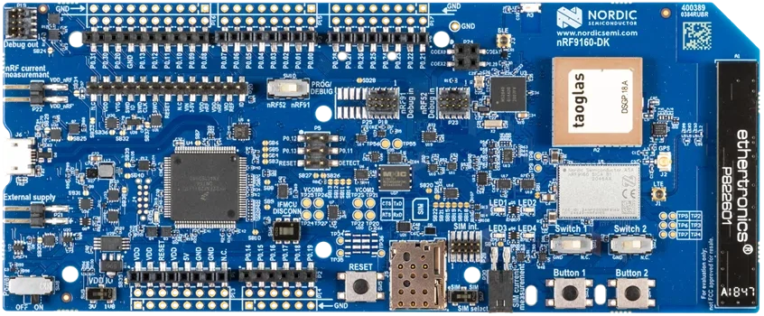

## Markus Tacker

:::::::::::::: {.columns}

::: {.column width=40%}

{width=50%}

:::

::: {.column width=48%}

Senior R&D Engineer, Nordic Semiconductor, Trondheim

<small>**Software crafter. Code donor. Mentor. Speaker. Conference & Community
builder. Camper.**</small>

[\@coderbyheart](https://twitter.com/coderbyheart)

<small>Pronouns: he/him</small>

:::

::::::::::::::

## Agenda

- Project and testing goals
- Problems and solutions
- Learnings and outlook

## The project

Joined team working on
[_Asset Tracker sample_](https://developer.nordicsemi.com/nRF_Connect_SDK/doc/1.9.1/nrf/applications/asset_tracker_v2/doc/asset_tracker_v2_description.html):
[open-source firmware sample](https://github.com/nrfconnect/sdk-nrf/tree/v1.9.1/applications/asset_tracker_v2)
based on [Zephyr RTOS](https://www.zephyrproject.org/) for an asset tracker
using two of our development kits.

I am building the cloud backend.

## Development Kits

:::::::::::::: {.columns}

::: {.column width=48%}



[nRF9160 DK](https://www.nordicsemi.com/Products/Development-hardware/nrf9160-dk)

:::

::: {.column width=48%}


[Thingy:91](https://www.nordicsemi.com/Products/Development-hardware/Nordic-Thingy-91)

:::

::::::::::::::

## System overview

{width=30%}

## Needs

Ensure that cloud backend and application work together.

Provide up-to date firmware for testing (endpoints need to be hardcoded).

## QA resources closed-source

However, build pipeline for our _open-source_ sample applications was **closed
source**, using Jenkins.

Tests **closed source**.

## My Goals

Test firmware automatically for every change (I want to go on vacation!).

- on GitHub Actions (so customers can see, copy, adapt)
- because **CONTINUOUS DELIVERY**!
- More robust products = more $$$ (and we don't want our customers to end up on
  @internetofshit).

## Problems

Setting up system for building applications was only documented as manual
process.

## Solution: Docker for dependencies

Created a [Dockerfile](https://github.com/NordicPlayground/asset-tracker-docker)
that has all the dependencies.

- Nightly tests which build applications
- Generalized for all samples and applications in SDK

GitHub Actions supports Docker, so I can now
[build it automatically](https://github.com/NordicSemiconductor/asset-tracker-cloud-firmware-aws/blob/34d297f5fbfd43a1e6c55ab5e12d5ed7ee94655a/.github/workflows/build-and-release.yaml)!

## Warning: Docker is not deterministic!

If you are using this approach you must be aware that you are using software
from many untrusted sources with all the consequences that brings.

- Docker images are not deterministic. At build time, dependencies are fetched
  from third-party sources and installed. These dependencies could also contain
  malicious code.
- The entire image creation and publication is automated (build on GitHub
  Actions, and served by Dockerhub), which means there are multiple systems that
  can be compromised, during and after publication.
- Through automation we only ensure that the application can be build.

## More problems

Our SDK is a mono-repo.

- application I am interested in is in a sub folder, but customers often use
  _out-of-tree_ development model (and should!): SDK as a dependency, not a
  fork.

## Solution: out-of-tree copy of subfolder

Use GitHub Actions to copy subfolder into
[seperate repository](https://github.com/NordicSemiconductor/asset-tracker-cloud-firmware-aws/).

- Shows customers how it would look like for them.
- Pulls in SDK as a dependency.
- One repo per cloud-provider
  ([Azure](https://github.com/NordicSemiconductor/asset-tracker-cloud-firmware-azure/))
  - cloud abstraction to support multiple cloud backends is not used by
    customers in practice.
- Introduces
  [semantic release](https://github.com/semantic-release/semantic-release) on
  commit (not done in our SDK release process)

## Even more problems

Can't use emulation (e.g. running in QEMU).

- removes entire network stack, so tests do not cover huge problem surface
- A lot of problems during testing are because of issues with TLS
  - certificates
  - hostname
  - provisioning (JITP)

## Solution: run on real hardware

{width=50%}

## Workflow in GitHub Actions

1. Commit to repo triggers a GitHub Actions workflow
1. Compile firmware for test
1. Create credentials for device
1. Flash the firmware and credentials to the test board
1. Firmware boots, and (hopefully) connects to cloud
1. Test runner schedules FOTA
1. Test runner observes device activity (UART and in cloud) until success state
   reached, or timeout / error occurs

## Compile firmware for test

Runs on a GitHub runner, pulls Docker image and compiles the firmware. HEX file
is stored as artifact.  
<small>[Source](https://github.com/NordicSemiconductor/asset-tracker-cloud-firmware-aws/blob/34d297f5fbfd43a1e6c55ab5e12d5ed7ee94655a/.github/workflows/build-and-release.yaml#L118)</small>

```bash
docker run --rm -v ${PWD}:/workdir/project nordicplayground/nrfconnect-sdk:main \
  /bin/bash -c '\
    cd firmware && \
    west init -l && \
    west update --narrow -o=--depth=1 && \
    west build -p always -b ${{ matrix.board }} -- \
      -DOVERLAY_CONFIG="overlay-aws.conf;overlay-pgps.conf;overlay-debug.conf;asset-tracker-cloud-firmware-aws.conf;firmware.conf" \
      -DEXTRA_CFLAGS="-Werror=format-truncation"\
    '
```

## Create credentials for device

Repository has intermediate CA certificate, which can be used to create device
certificates.

Runner creates a certificate for a device with a unique and random name.

Certificate is stored as artifact.

<small>[Source](https://github.com/NordicSemiconductor/asset-tracker-cloud-firmware-aws/blob/34d297f5fbfd43a1e6c55ab5e12d5ed7ee94655a/.github/workflows/build-and-release.yaml#L195-L210)</small>

## Flash the firmware and credentials to the test board

On a
[self-hosted runner](https://docs.github.com/en/actions/hosting-your-own-runners/about-self-hosted-runners))
with a development kit attached, the firmware and the certificates are flashed.

- Started with RaspberryPI (ARM64 is supported by Segger)
- Now Ubuntu on an Intel NUC (faster to update)

There are all kinds of reasons why devices crash, so turning it on and off again
is needed (power cycle).

{width=30%}

[YKUSH 3](https://www.yepkit.com/product/300110/YKUSH3)

## Firmware boots, and (hopefully) connects to cloud

```
<dbg> aws_iot_integration: cloud_wrap_init: ********************************************
<dbg> aws_iot_integration: cloud_wrap_init:  The Asset Tracker v2 has started
<dbg> aws_iot_integration: cloud_wrap_init:  Version:     67bcbead673f5a16908ef396b79e390e3ee1e6cd-nrf9160dk_nrf9160_ns-a11d8e1b-9751-4036-9deb-0ed875c1ded2-original
<dbg> aws_iot_integration: cloud_wrap_init:  Client ID:   a11d8e1b-9751-4036-9deb-0ed875c1ded2
<dbg> aws_iot_integration: cloud_wrap_init:  Cloud:       AWS IoT
<dbg> aws_iot_integration: cloud_wrap_init:  Endpoint:    a3nkol2gd45hn0-ats.iot.***.amazonaws.com
<dbg> aws_iot_integration: cloud_wrap_init: ********************************************
```

## Test runner schedules FOTA

The test runner waits for the device to connect to the cloud (write to it's
shadow), then schedules a FOTA.

```
# Device has connected and reported device information.

<dbg> watchdog: primary_feed_worker: Feeding watchdog

# FOTA job "db572411-d7da-4c32-8f0c-5684e84c9242" created.
```

## Device downloads FOTA image

```
<inf> download_client: Downloading: a11d8e1b.bin [0]
<dbg> ui_module: state_set:
      State transition STATE_RUNNING --> STATE_FOTA_UPDATING

<inf> download_client: Downloaded 1024/286472 bytes (0%)
...
<inf> download_client: Downloaded 286472/286472 bytes (100%)
<inf> download_client: Download complete
```

## Device flashes FOTA image and reboots

```
<dbg> STREAM_FLASH: stream_flash_erase_page: Erasing page at offset 0x000ef000
<inf> dfu_target_mcuboot: MCUBoot image-0 upgrade scheduled.
      Reset device to apply
<inf> app_event_manager: MODEM_EVT_SHUTDOWN_READY
<err> util_module: Rebooting!

I: Starting bootloader
I: Primary image: magic=unset, swap_type=0x1, copy_done=0x3, image_ok=0x3
I: Secondary image: magic=good, swap_type=0x2, copy_done=0x3, image_ok=0x3
I: Boot source: none
I: Swap type: test
I: Bootloader chainload address offset: 0x10000
I: Jumping to the first image slot
*** Booting Zephyr OS build 186cf4539e5a  ***
```

## Device reports new version to the cloud

```
<dbg> aws_iot_integration: cloud_wrap_init: ********************************************
<dbg> aws_iot_integration: cloud_wrap_init:  The Asset Tracker v2 has started
<dbg> aws_iot_integration: cloud_wrap_init:  Version:     67bcbead673f5a16908ef396b79e390e3ee1e6cd-nrf9160dk_nrf9160_ns-a11d8e1b-9751-4036-9deb-0ed875c1ded2-upgraded

<endOn> Termination criteria seen: aws_iot_integration: cloud_wrap_init:  Version:     67bcbead673f5a16908ef396b79e390e3ee1e6cd-nrf9160dk_nrf9160_ns-a11d8e1b-9751-4036-9deb-0ed875c1ded2-upgraded

<dbg> aws_iot_integration: cloud_wrap_init:  Client ID:   a11d8e1b-9751-4036-9deb-0ed875c1ded2
<dbg> aws_iot_integration: cloud_wrap_init:  Cloud:       AWS IoT
<dbg> aws_iot_integration: cloud_wrap_init:  Endpoint:    a3nkol2gd45hn0-ats.iot.***.amazonaws.com
<dbg> aws_iot_integration: cloud_wrap_init: ********************************************
```

## Test runner observes device activity

Using UART we can immediately react on device output.

Nice, but:

- changes easily (spaces can break assertion)
- UART sometimes gets garbled
- Needs debugger (devices could be programmed using MCUBoot)

More hassle, than it's worth.  
Store output, but don't depend on them for testing.

Treat device as black box: observe outcome on cloud side.

## Test successfull!

We have now ensured, that

- the device can connect
- reports it's configuration to the cloud
- handles firmware-over-the-air updates


## Should we test more?

We could do more, but:

- many things can be covered easier in unit tests
- from the cloud backend perspective connectivity + FOTA is the critical feature

## Learnings

The toolchain for embedded devices (that I use) was not designed with automation
in mind.

It's hard to get it to work, understanding the how everything plays together is
a massive mindfuck.

It is NOT [reproducible](https://reproducible-builds.org/).

## Outlook

I need to:

- remove test dependency on UART
- have multiple DKs per PC to test in parallel
- look into _commoditizing_ this approach

## Outro

- end-to-end tests catch issues which are not found in unit testing
- however, we can't test everying e2e, it's way too expensive
- both are neccessary

## Thank you & happy connecting!

Please share your feedback!

<small>[Markus.Tacker@NordicSemi.no](mailto:Markus.Tacker@NordicSemi.no)  
[\@coderbyheart](https://twitter.com/coderbyheart)</small>

<small>Latest version:  
[`bit.ly/fwtesting`](https://bit.ly/fwtesting)</small>

We are hiring!  
[nordicsemi.com/jobs](https://nordicsemi.com/jobs)  
<small>Trondheim &middot; Oslo &middot; 20+ more locations</small>
