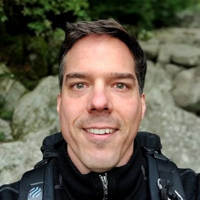
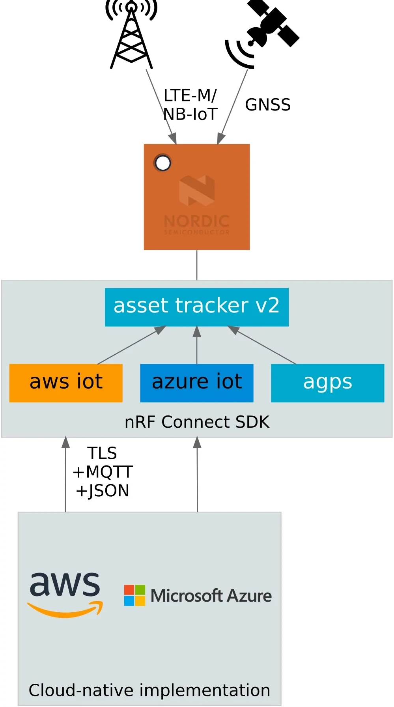
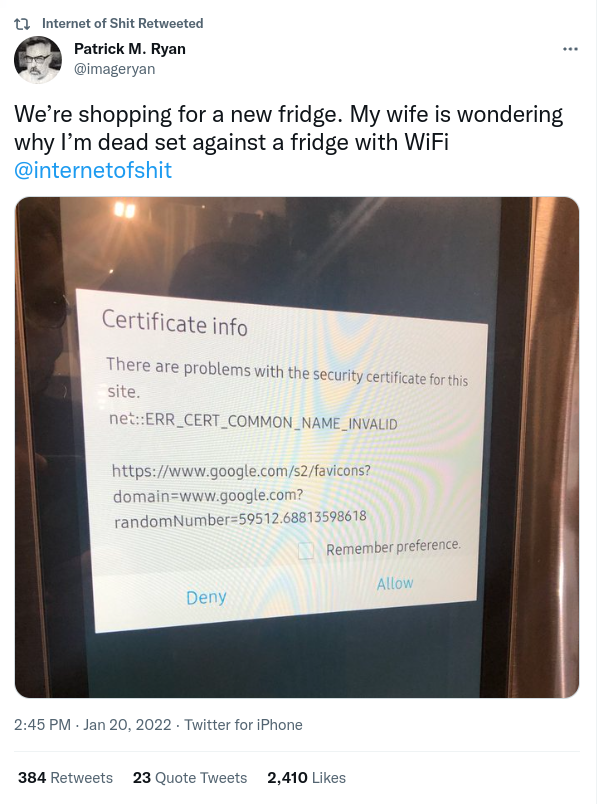
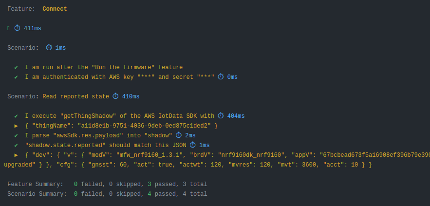

# Markus Tacker

:::::::::::::: {.columns}

::: {.column width=40%}

{width=50%}

:::

::: {.column width=48%}

Senior R&D Engineer  
Trondheim

[\@coderbyheart](https://twitter.com/coderbyheart)

<small>Pronouns: he/him</small>

:::

::::::::::::::

# Agenda

- Project and (Testing) Goals
- Problems and Solutions
- Learnings and Benefits

# The project

In 2019, I joined a team working on
[open-source firmware sample](https://github.com/nrfconnect/sdk-nrf/tree/v1.9.1/applications/asset_tracker_v2)
using two development kits for cellular IoT.

# Development Kits

:::::::::::::: {.columns}

::: {.column width=48%}

<div class="text-center">


[Nordic Semiconductor nRF9160 DK](https://www.nordicsemi.com/Products/Development-hardware/nrf9160-dk)

</div>

:::

::: {.column width=48%}

<div class="text-center">


[Nordic Semiconductor Thingy:91](https://www.nordicsemi.com/Products/Development-hardware/Nordic-Thingy-91)

</div>

:::

::::::::::::::

# 🌩️

I am responsible for demonstrating <u>to our customers</u> what they need on the
cloud side.

# System overview

{width=30%}

# Let's take the customer's perspective

<div class="text-center">

<small>This talk is my personal opinion, and does not represent the views of my
employer.</small>

</div>

# Needs

1. Ensure that cloud backend and firmware application work together **for every
   commit**.
2. Provide up-to date firmware for testing (endpoints need to be hardcoded) and
   **automated** releases.  
   <small>2 hardware targets × 3 debug levels × 4 files =
   [24 artifacts / change](https://github.com/NordicSemiconductor/asset-tracker-cloud-firmware-aws/releases/tag/v3.3.0)</small>

# QA resources closed-source

Firmware build pipeline for the **open-source** sample applications is **closed
source**.

Pipeline to run tests is **closed source**, too.

# My Goals

Test firmware automatically for every change.

- because Continuous Delivery **solves all your problems**  
  (don't trust me, read [Accelerate](https://itrevolution.com/book/accelerate/))

- on GitHub Actions  
  (so others can see, copy, adapt, improve)

- more robust products = more $$$  
  (and we don't want to end up on
  [@internetofshit](https://twitter.com/internetofshit)).

# Accelerate

{width=40%}

# @internetofshit

{width=40%}

# Problems and Solutions

# Problem #1

Setting up system for building firmware in the SDK is only documented as a
manual process.

# Solution: Docker

I've created a [Docker image](https://github.com/NordicPlayground/nrf-docker)
that provides all required dependencies.

- Nightly tests which build firmware application
- Generalized for all firmware samples and applications in the SDK (so others
  can re-use)

# GitHub Actions &lt;3 Docker

GitHub Actions support Docker, so I can now
[build firmware from the SDK automatically](https://github.com/NordicSemiconductor/asset-tracker-cloud-firmware-aws/blob/34d297f5fbfd43a1e6c55ab5e12d5ed7ee94655a/.github/workflows/build-and-release.yaml)!

<div class="text-center">

[](https://github.com/NordicPlayground/nrf-docker)

</div>

# Warning: Docker is not deterministic!

If you are using this approach you must be aware that you are using software
from many untrusted sources with all the consequences that brings.

- Docker images are not deterministic. At build time, dependencies are fetched
  from third-party sources and installed. These dependencies could also contain
  malicious code.
- The entire image creation and publication is automated (build on GitHub
  Actions, and served by Dockerhub), which means there are multiple systems that
  can be compromised, during and after publication.
- Through automation we only ensure that the application can be build.

# Problem #2

The SDK is a monorepo with a slow release cycle (months).

- The firmware application sample I am interested in is in a sub folder, but we
  want to _out-of-tree_ development model: SDK as a dependency, not a fork.
- Has configuration for multiple cloud backends, but I am only interested in
  one.
- We want a short release cycle (hours—days).

# Solution: out-of-tree copy of subfolder

Use GitHub Actions to copy subfolder into
[seperate repository](https://github.com/NordicSemiconductor/asset-tracker-cloud-firmware-aws/).

- Takes customers/users perspective.
- Pulls in SDK as a dependency.
- One repo per cloud-provider
  ([AWS](https://github.com/NordicSemiconductor/asset-tracker-cloud-firmware-aws/),
  [Azure](https://github.com/NordicSemiconductor/asset-tracker-cloud-firmware-azure/),
  ...)
  - cloud abstraction to support multiple cloud backends is not used by
    customers in practice.
- Introduces
  [semantic release](https://github.com/semantic-release/semantic-release) on
  commit (not done in the SDK release process), because
  [**CONTINUOUS DELIVERY**](https://itrevolution.com/book/accelerate/)!

# Problem #3

Can't use emulation (e.g. running in QEMU).

- removes entire network stack, so tests do not cover huge problem surface.

A lot of problems during testing are because of connection issues (TLS):

- certificates
- hostname(s)
- provisioning on the cloud side

# Solution: run on real hardware

{width=50%}

# Workflow in GitHub Actions

1. Commit to repo triggers a GitHub Actions workflow
1. Compile firmware for test
1. Create credentials for device
1. Flash the firmware and credentials to the test board
1. Firmware boots, and (hopefully) connects to cloud
1. Test runner schedules FOTA
1. Test runner observes device activity (UART and in cloud) until success state
   reached, or timeout / error occurs

# Compile firmware for test

Runs on a GitHub runner, pulls Docker image and compiles the firmware. HEX file
is stored as artifact.  
<small>[Source](https://github.com/NordicSemiconductor/asset-tracker-cloud-firmware-aws/blob/34d297f5fbfd43a1e6c55ab5e12d5ed7ee94655a/.github/workflows/build-and-release.yaml#L118)</small>

```bash
docker run --rm -v ${PWD}:/workdir/project nordicplayground/nrfconnect-sdk:main \
  /bin/bash -c '\
    cd firmware && \
    west init -l && \
    west update --narrow -o=--depth=1 && \
    west build -p always -b ${{ matrix.board }} -- \
      -DOVERLAY_CONFIG="overlay-aws.conf;overlay-pgps.conf;overlay-debug.conf;asset-tracker-cloud-firmware-aws.conf;firmware.conf" \
      -DEXTRA_CFLAGS="-Werror=format-truncation"\
    '
```

# Create credentials for device

Runner creates a certificate for a device with a unique and random name.

Repository has intermediate CA certificate, which can be used to create device
certificates.

Certificate is stored as artifact (so it can be accessed by other jobs later).

<small>[Source](https://github.com/NordicSemiconductor/asset-tracker-cloud-firmware-aws/blob/34d297f5fbfd43a1e6c55ab5e12d5ed7ee94655a/.github/workflows/build-and-release.yaml#L195-L210)</small>

# Flash the firmware and credentials to the test board

On a
[self-hosted runner](https://docs.github.com/en/actions/hosting-your-own-runners/about-self-hosted-runners),
with a development kit attached, the firmware and the certificates are flashed
onto the development kit.

- Started with RaspberryPI (ARM64 is supported by Segger)
- Now Ubuntu on an Intel NUC (more enjoyable to work with)

# Power cycle!

There are all kinds of reasons why devices crash, so turning it on and off again
is needed (power cycle).

<div class="text-center">

{width=30%}

[YKUSH 3](https://www.yepkit.com/product/300110/YKUSH3)

</div>

# Firmware boots, and (hopefully) connects to the cloud

```
********************************************
 The Asset Tracker v2 has started
 Version:     67bcbead-original
 Client ID:   a11d8e1b-9751-4036-9deb-0ed875c1ded2
 Cloud:       AWS IoT
 Endpoint:    abcdef12345678-ats.iot.eu-west1.amazonaws.com
********************************************
```

# Test runner schedules FOTA

The test runner waits for the device to connect to the cloud (until it writes to
its shadow), then schedules a FOTA.

```
# Device has connected and reported device information.

<dbg> aws_iot_integration: aws_iot_event_handler: AWS_IOT_EVT_CONNECTED

# FOTA job "db572411-d7da-4c32-8f0c-5684e84c9242" created.
```

# Device downloads FOTA image

```
<inf> download_client: Downloading: a11d8e1b.bin [0]
<dbg> ui_module: state_set:
      State transition STATE_RUNNING --> STATE_FOTA_UPDATING

<inf> download_client: Downloaded 1024/286472 bytes (0%)
      ...
<inf> download_client: Downloaded 286472/286472 bytes (100%)
<inf> download_client: Download complete
```

# Device flashes FOTA image and reboots

```
<dbg> STREAM_FLASH: stream_flash_erase_page: Erasing page at offset 0x000ef000
<inf> dfu_target_mcuboot: MCUBoot image-0 upgrade scheduled.
      Reset device to apply
<inf> app_event_manager: MODEM_EVT_SHUTDOWN_READY
<err> util_module: Rebooting!

I: Starting bootloader
I: Primary image: magic=unset, swap_type=0x1, copy_done=0x3, image_ok=0x3
I: Secondary image: magic=good, swap_type=0x2, copy_done=0x3, image_ok=0x3
I: Boot source: none
I: Swap type: test
I: Bootloader chainload address offset: 0x10000
I: Jumping to the first image slot
*** Booting Zephyr OS build 186cf4539e5a  ***
```

# Device reports new version to the cloud

```
********************************************
 The Asset Tracker v2 has started
 Version:     67bcbead-upgraded
 Client ID:   a11d8e1b-9751-4036-9deb-0ed875c1ded2
 Cloud:       AWS IoT
 Endpoint:    abcdef12345678-ats.iot.eu-west1.amazonaws.com
********************************************
```

# Observe device activity

Using UART we can immediately react on device output.

```
<endOn> Termination criteria seen: aws_iot_integration: cloud_wrap_init:  Version:     67bcbead-upgraded
```

Nice, but:

- changes easily (spaces can break assertion)
- UART sometimes gets garbled (USB cables suck)

More hassle, than it's worth.  
Store output, but don't depend on it for testing.

Treat device as black box: observe outcome on cloud side.

# Test successfull!

We have now ensured, that

- the device can connect
- reports it's configuration to the cloud
- handles firmware-over-the-air updates

# BDD scenario example

Tests are describe in
[BDD scenarios](https://github.com/NordicSemiconductor/asset-tracker-cloud-firmware-aws/blob/c15489e4254cdfa83e115720a815e507bfeb2683/features/Connect.feature):

{width=70%}

# Should we test more?

We could test more, but:

- many things can be covered easier in unit tests
- from the cloud backend perspective connectivity + FOTA is **THE** critical
  feature
- firmware application is "intelligent", takes a lot of effort (_hacks_) to
  control it from the outside

# Learnings

The toolchain for embedded devices (that I use) was not designed with automation
in mind.

It's hard to get it to work.

It is NOT [reproducible](https://reproducible-builds.org/).

Uderstanding how everything plays together is a massive mindfuck.

But it IS possible!

# Benefits

- end-to-end tests catch issues which are not found in unit testing
- I have discovered critical issues through this black-box testing
- also provides WORKING documentation and tracks changes of how to build
  firmware applications

# Thank you & happy connecting!

<div class="text-center">

Please share your feedback!

<small>[m@coderbyheart.com](mailto:m@coderbyheart.com)  
[\@coderbyheart](https://twitter.com/coderbyheart)</small>

<small>Latest version:  
[`bit.ly/fwtesting`](https://bit.ly/fwtesting)</small>

We are hiring!  
[nordicsemi.com/jobs](https://nordicsemi.com/jobs)  
<small>Trondheim &middot; Oslo &middot; 20+ more locations</small>

</div>
